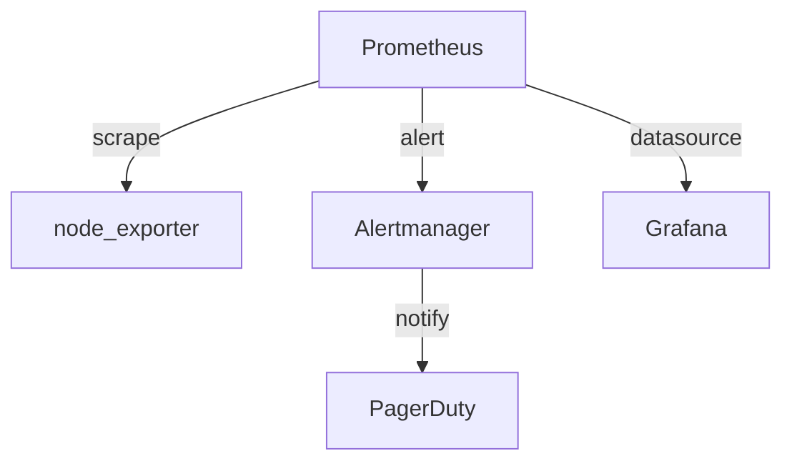

Everything you need to write posts in jekyll-infops-theme. Bookmark this page and come back to it — it covers every supported element.

---

## Front matter

Every post starts with a YAML block between `---` delimiters:

```yaml
---
layout: post
title:  "Monitoring a Linux fleet with Prometheus and Grafana"
date:   2025-03-15 09:00:00 +0100
author: "50bvd"

# SEO & listing
description: "Step-by-step guide to deploying Prometheus node_exporter across 40+ servers."
categories: [monitoring, linux]
tags:       [prometheus, grafana, alertmanager, node-exporter]

# Features
toc:      true     # show table of contents (default: true from _config.yml)
comments: true     # enable Utterances/Disqus (default: true)
mermaid:  false    # load Mermaid.js for diagrams
math:     false    # load MathJax for LaTeX equations
---
```

`layout`, `title` and `date` are required. Everything else uses the `defaults:` from `_config.yml` as fallback.



---

## Callouts

Callouts are the most-used include in this theme. They add visually distinct contextual blocks anywhere in Markdown:

```liquid

```

Six types available:








The `content` parameter supports inline Markdown: `**bold**`, `` `code` ``, and `[links](url)` all work.

---

## Code blocks

Wrap code in triple backticks and add a language identifier:

````markdown
```bash
systemctl status prometheus.service
journalctl -u prometheus -f --since "10 minutes ago"
```
````

The theme wraps every block in a styled header (language label + Copy button) and a CRT-style dark body. The copy button captures the raw source text — Prism tokenisation doesn't leak into the clipboard.

**Supported identifiers** (non-exhaustive):

`bash` · `sh` · `zsh` · `powershell` · `yaml` · `json` · `toml` · `ini` · `nginx` · `dockerfile` · `python` · `ruby` · `javascript` · `typescript` · `go` · `rust` · `sql` · `html` · `css` · `scss` · `diff` · `markdown`

Full list: [prismjs.com/#supported-languages](https://prismjs.com/#supported-languages)

---

## Inline elements

| Element | Markdown | Output |
|---|---|---|
| Bold | `**bold**` | **bold** |
| Italic | `*italic*` | *italic* |
| Strikethrough | `~~strike~~` | ~~strike~~ |
| Inline code | `` `code` `` | `code` |
| Link | `[text](url)` | [text](#) |
| Image | `` | _(image)_ |

---

## Tables

Standard GFM tables get full styling automatically — zebra rows, hover highlight, horizontal scroll on mobile:

```markdown
| Service    | Port | Protocol | Status |
|---|---|---|---|
| Prometheus | 9090 | HTTP     | ✅ online |
| Grafana    | 3000 | HTTP     | ✅ online |
| Alertmanager | 9093 | HTTP  | ⚠️ degraded |
| node_exporter | 9100 | HTTP | ✅ online |
```

| Service | Port | Protocol | Status |
|---|---|---|---|
| Prometheus | 9090 | HTTP | ✅ online |
| Grafana | 3000 | HTTP | ✅ online |
| Alertmanager | 9093 | HTTP | ⚠️ degraded |
| node_exporter | 9100 | HTTP | ✅ online |

---

## Blockquotes

```markdown
> In theory, theory and practice are the same. In practice, they aren't.
>
> <cite>Yogi Berra (attributed)</cite>
```

> In theory, theory and practice are the same. In practice, they aren't.
>
> <cite>Yogi Berra (attributed)</cite>

---

## Table of Contents

The TOC is auto-generated from all `h2`, `h3`, and `h4` headings in the post body. An IntersectionObserver highlights the active section as the reader scrolls. A floating TOC toggle also appears in the right margin on wide screens.

Disable for a specific post: `toc: false` in front matter.

---

## Mermaid diagrams

Add `mermaid: true` to front matter, then use a fenced block:

````markdown

````

Mermaid supports flowcharts, sequence diagrams, Gantt charts, ER diagrams and more. See [mermaid.js.org](https://mermaid.js.org/intro/) for the full syntax.

---

## Lazy-loaded images

Regular Markdown images load immediately. For images below the fold, use `data-src` to defer loading until they enter the viewport:

```html

```

The `lazy-load.js` module uses `IntersectionObserver` with a 200px rootMargin, so images start loading just before they scroll into view.

---

## MathJax equations

Add `math: true` to front matter to load MathJax:

```markdown
Inline: $E = mc^2$

Display:
$$\nabla \cdot \mathbf{E} = \frac{\rho}{\varepsilon_0}$$
```

MathJax v3 is loaded from jsDelivr, only on pages that need it.
